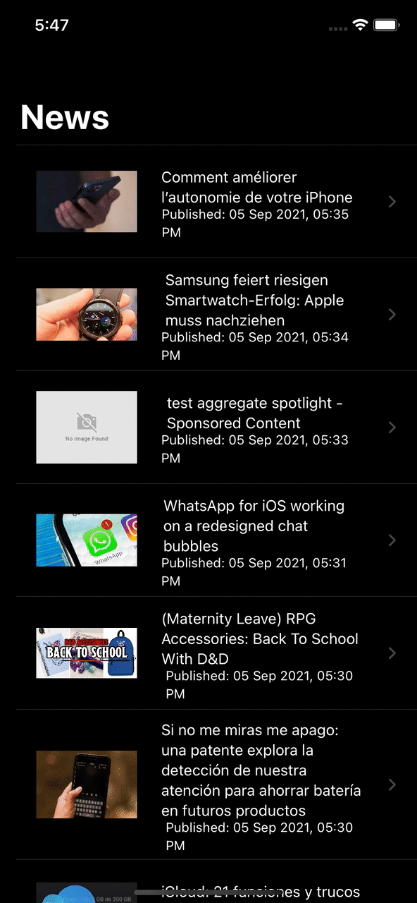

# NewsDemoApp
Demo News App with Master and Details Screen written in SwiftUI, Combine

### Steps to run the app.
1. Visit https://newsapi.org/docs/get-started and get access token.
2. Go to Constants.swift file, Replace `Your access token here` with `AccessToken` generated on step 1.
3. Run the app.

### Sample output

